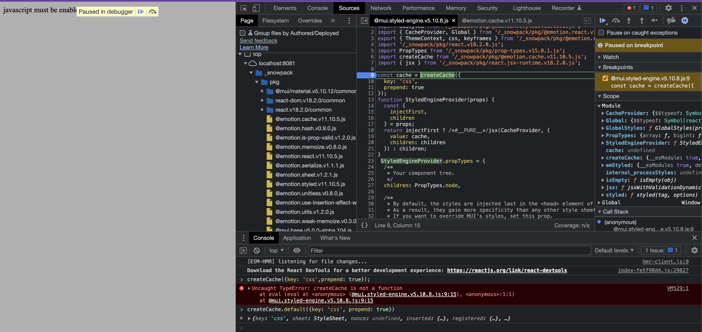
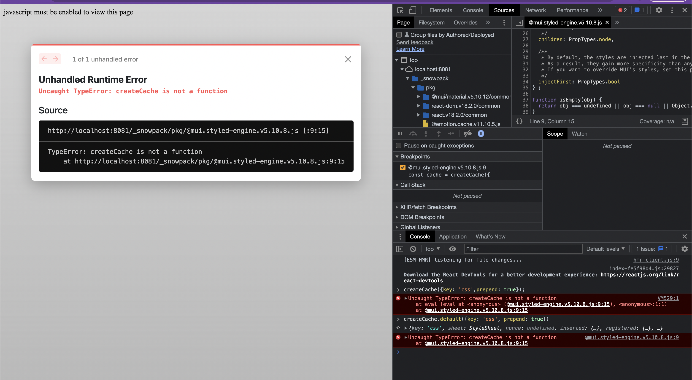

This project highlights an issue using @emotion as a dependency of @mui. It appears that the defualt export of @emotion.cache (createCache) is not being transformed properly.

You can see in the following captures that attempting to use ```createCache``` throws an error indicating that ```createCache``` is not a function. Upon inspection it becomes evident that ```createCache.default``` is the function that was intended to be called. This seems like an error in import logic, but I am not smart enough to figure this out myself :/

To try it yourself just:
```yarn install && yarn start```



